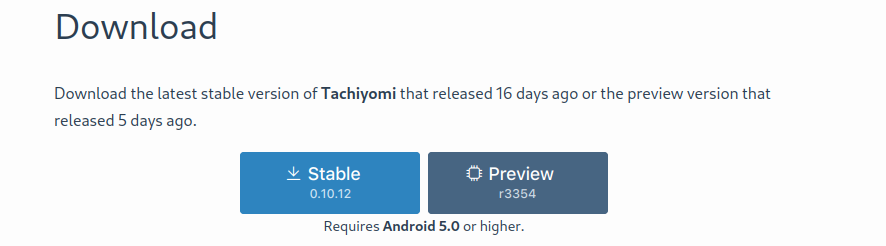
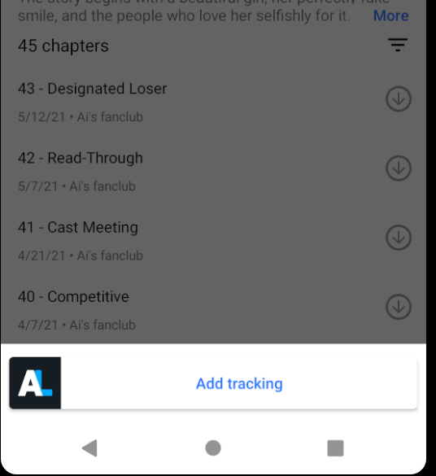

# A Guide on How to Use Tachiyomi <!-- omit in toc -->

This is the Kaguya server’s unofficial guide to setting up Tachiyomi. This guide is focused on the basics:

- Introducing what Tachiyomi is
- How to set up extensions to read manga
- Getting automatic updates
- Tracking
- Maybe some other minor stuff.

Note that this is also not an official support guide from Tachiyomi, free to check out their own user guide if you need to, especially if something isn’t covered in this guide.

This is an updated version of the very outdated and old guide from before. You can still read that [here](https://docs.google.com/document/d/1W63bvk9CmkFYa9JM_5pVJgacHlowK7wewIAJk1KGRkQ/) if you want.

---

- [What is Tachiyomi?](#what-is-tachiyomi)
  - [Wait, what do you mean, “Android only”?](#wait-what-do-you-mean-android-only)
- [So why should I use Tachiyomi?](#so-why-should-i-use-tachiyomi)
- [How do I install Tachiyomi?](#how-do-i-install-tachiyomi)
- [How do I read manga?](#how-do-i-read-manga)
- [How do I get updates for manga?](#how-do-i-get-updates-for-manga)
- [How do I set up tracking?](#how-do-i-set-up-tracking)
- [Other things you might want to do](#other-things-you-might-want-to-do)
  - [Setting up backups](#setting-up-backups)
  - [Adjusting the reader](#adjusting-the-reader)
- [Common problems](#common-problems)
  - [All my Mangadex entries don’t work!](#all-my-mangadex-entries-dont-work)
- [Problems? Mistakes? Issues?](#problems-mistakes-issues)

---

## What is Tachiyomi?

It is a free, open source (so all the code is free for the world to see, nobody’s hiding anything sneaky in there) manga reading app for Android only, with support for getting titles from a large number of manga sites.

### Wait, what do you mean, “Android only”?

Yep, let’s get this out of the way before we continue any further. Tachiyomi is only for Android. Sorry iOS users - take a look at something like Paperback, or just use Cubari to proxy sources. These are both out of scope for this guide.

## So why should I use Tachiyomi?

Personally, these are the reasons I really like Tachiyomi:

- Open source, if you care about that - everyone can see the code.
- Free.
- Many manga sources available, with the list growing by the day. Anyone can add a source if they want.
- Has downloads for offline reading.
- Actively developed.
- Customizable reader.
- Support for local content.
- Integrations with sites like Anilist for helping you track what you've read.

## How do I install Tachiyomi?

Unfortunately, likely for many reasons (like piracy), you cannot simply get Tachiyomi on something like the Play Store. If you use [F-Droid](https://www.f-droid.org/), you can directly download it. Otherwise, you will probably have to sideload the app.

Thankfully, this is pretty simple to do!

1. Go to [Tachiyomi’s release page](https://tachiyomi.org/download/) on your phone, and grab the latest .apk file under “Assets”:

   

   You can also consider the "Preview" version, which may have some newer unreleased features.

2. Once you have the file downloaded, you want to install it. Open the file and let it install - you might have to allow installations from unknown sources.

   

## How do I read manga?

By default, Tachiyomi doesn't actually have any manga to choose. This is because Tachiyomi doesn't actually host any manga - it is basically just a convenient app that brings together a lot of different sources of manga for you to pick from (e.x. Mangadex, Mangasee, Dynasty, Komga), and provides a slick mobile reader to use.

You can start browsing these sources through _Extensions_. These are Tachiyomi’s way of adding a manga website as a catalogue to browse through and read manga from. Let's try this for Guya, the best place to read Kaguya!

1. First, go to "Browse" tab at the bottom:

   

2. Next, go to the "Extensions" tab at the top:

   

3. Now, time to pick which extension you want. For our case, let's scroll down to "Guya" and click "Install".

   

4. At this point, it'll prompt you to install an app, and probably give you a warning about how Tachiyomi isn't allowed to install apps from unknown sources:

   

   This is normal, don't worry. Click on "Settings" and you'll be brought to a screen like this:

   

   And make sure "Allow from this source" is checked.

5. You can now press the back button, and you should get something like this:

   

   You can now install the extension. If you don't see it, that's fine, just try to install the extension again.

6. If all went well, you should see that the extension is now listed as installed:

   

7. Now go back to "Sources", you should see your extension:

   

8. Now open it, and you'll see some titles to pick!

   

9. Let's try opening one of these - for example, the main "Kaguya-sama" series:

   

   You can click on a chapter entry to read it. There are also options for downloading each chapter individually beside each chapter, and an option at the top to download multiple chapters at once.

   There is also an option to "Add to library" - this is a collection of sources, so you don't have to look this exact source up the next time you want to (re)read Kaguya again. Let's click that.

10. Now go back out and go to the "Library" tab at the bottom. You should see your newly-added entry!

    

That's it! You've successfully added an extension and added a manga entry to your library. Now go out there and do this with other sources and manga you like - Mangadex, for example.

## How do I get updates for manga?

You can manually get updates by going to the Library and pulling down to trigger an update. You will then see any updates in the Updates tab and your notifications.

Alternatively, you can set up automatic update tracking. Go to "More":

Then "Settings":

Then "Library":

Here, you can see that by default, it is set up to update daily. You can tweak this to what you want. You can also tweak _what_ gets updated - which categories, only ongoing manga, etc.

## How do I set up tracking?

You can get Tachiyomi to automatically update your tracking service of choice (if it's supported) when you finish reading a chapter.

To do so, from the home menu, go to "More":

Then "Settings":

Then "Tracking":

Click on the service you want to link to. For me, I'll use AniList to demonstrate; other services may differ a bit.

For AniList, this opens up a browser window asking me to log in:

After doing so, you should see a checkmark next to the tracking service:

Now, let's go to an entry you want to track, for example, in your Library:

Click "Tracking", then "Add Tracking":

You should get a list of titles to pick from - Tachiyomi isn't sure which tracking entry you want to link this title to, so it's just asking you to make sure:

Select the entry, and you should see the "Tracking" button has a checkmark, and you can control things like what chapter you've read, the score, etc.

By default, tracking is set up to automatically update as you read, though you can turn this off in the settings.

## Other things you might want to do

Some other things that might be handy to do:

### Setting up backups

Go to More -> Settings -> Backup. You can manually/automatically make backups of your libraries. This is handy if you want to move between phones, for example - you do not want to try to add thousands of entries manually, trust me.

### Adjusting the reader

You can adjust reader settings in More -> Settings -> Reader to however you want it.

## Common problems

### All my Mangadex entries don’t work!

Firstly, make sure Mangadex is actually, you know, up.

If you’re getting something along the lines of “Please migrate Mangadex to Mangadex”, then you probably used Tachiyomi with Mangadex sources prior to the hacking fiasco. During their rewrite, the Mangadex team apparently completely changed how they identified manga entries - that means that all your old Mangadex entries in Tachiyomi are basically dead.

So what do you do? Well, despite how confusing the instructions are, it is what you need to do - you need to migrate from Mangadex (the old entries) to Mangadex (the new entries).

So how do you do this? Well, it's either:

- Manually migrate each entry, one by one, since stock Tachiyomi does not have a bulk migration feature.
- Bulk migrate all your entries using [TachiyomiSY](https://tachiyomi.org/forks/TachiyomiSY/), which _does_ have a bulk migration feature.
  - What I personally did was download TachiyomiSY, make a backup of my existing Tachiyomi entries, import it into TachiyomiSY, bulk migrate, make a backup of the fixed library, and bulk migrate it back to normal Tachiyomi.
- Use the [Tachiyomi Mangadex Migrator](https://github.com/ivaniskandar/tachiyomi-mangadex-migrator):

  

## Problems? Mistakes? Issues?

If you have any problems, bugs, suggestions, etc, with Tachiyomi itself, please go to their [Discord](https://discord.gg/tachiyomi) or [GitHub](https://github.com/inorichi/tachiyomi). This guide was written with no affiliation with Tachiyomi or their devs.

If you find any errors with this guide (ie: outdated steps, typos, or other mistakes in general), or have suggestions to improve it, message/ping me (Pyreko) on the Kaguya server on Discord.

If you can’t get it to work, try to Google or look around the app. What might work is using the dev version of the app if you’re using stable, or vice versa.

If you wish to ask someone about something in regards to issues setting it up, again, you’re probably best off asking Tachiyomi devs on their Discord and Github. Please don’t ask me, or people on the Kaguya server if you haven’t tried other steps first. We aren’t tech support.

---

Last Updated: 2021-05-13

Tachiyomi version used during writing: r3346
